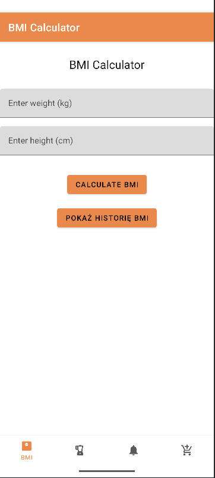
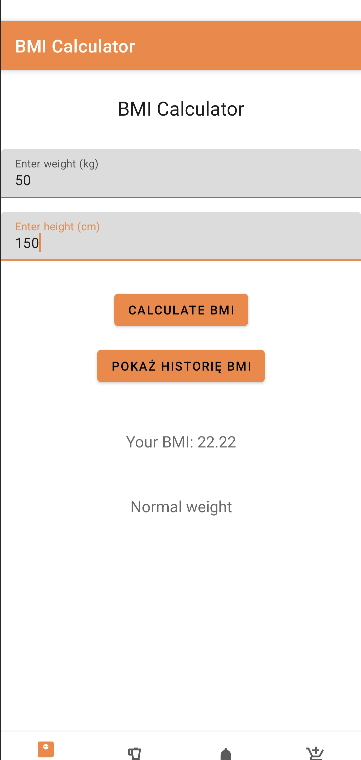
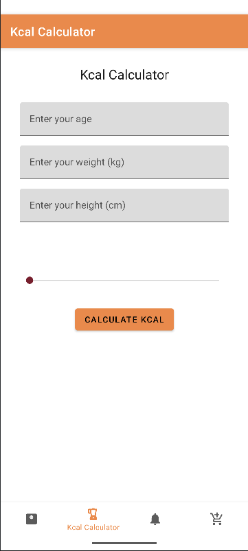
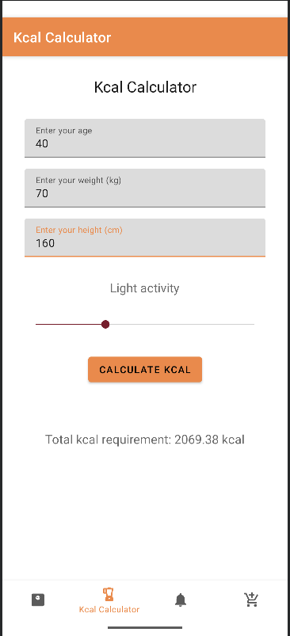
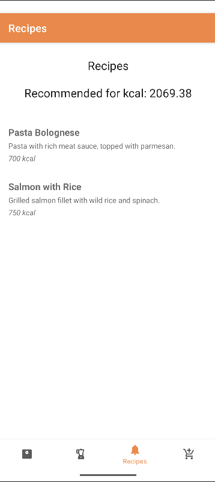
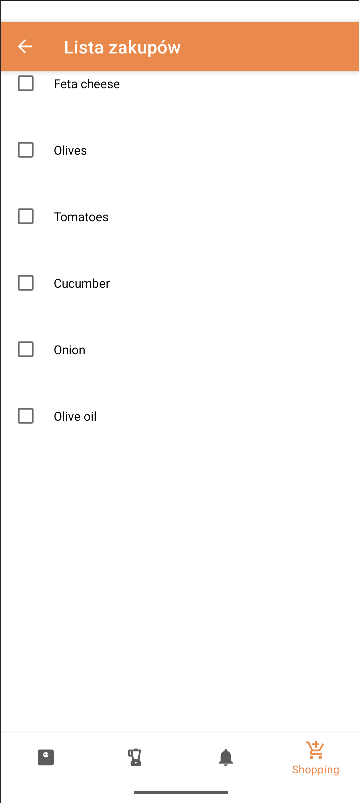
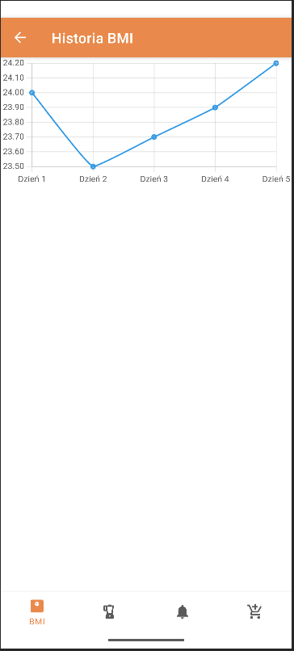

# s24279-PAMO_12-2025

Zadania są na osobnych branch'ach. 

Np. Zadanie pierwsze jest na branch'u o nazwie "zadanie-1"

## Funkcjonalności
- Oblicznie BMI
- Obliczanie zapotrzebowania kalorycznego na podstawie wieku, wagi, wzrostu i aktywności fizycznej
- Wyświetlenie proponowanych przepisów na podstawie wyliczonego zapotrzebowania (bez uprzedniego wyliczenia, przepisy są niedostepne)
- Lista zakupów
- Historia BMI (wykres)

## Screenshoty

### Ekran startowy

### BMI kalkulator

### BMI obliczone

### Kcal kalkulator

### Kcal obliczone

### Przepisy

### Lista

### BMI wykres

## Autor: Jakub Więcek s24279
